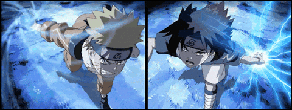

# tape

A from scratch implementation of reverse-mode autodiff inspired by PyTorch's autograd. The Tensor class is fully capable of building and a DAG and update gradients for any function thrown at it.

## Design decision: how the graph is stored

Each Tensor node holds on to a few class members like the parents -> that called the operation; a backward closure -> the local derivative of nodein accordance to its parents also respecting the chain rule.

harbours a backward() implementation that knows exactly the order to call the backward closures of each node (to compute local gradients) by using a great traversal algorithm called topological sort, implemented in an on stack way to tackle the recursive depth limits of python.

The order of the DAG was important to be preserved in case of a node that was being used in 2 separate operations, the graph has to treat each as a different branch and the order must make sure that the branches are resolved first before the main node is called. Thus marking the importance of the order backward() is called on the DAG.

## Design decision: broadcast-gradient reduction

One big challenge was to handle the gradients of a broadcasted tensor. 
forward pass for each operation is dependent on the numpy implementations of it.
backward pass to calculate gradients was handled in the implementation class. 

problem: gradients of a broadcasted tensor would not match the original tensors shape:

for example:
if A is of shape (3, 4) and B is of shape (1, 4)
for a sum of A and B numpy broadcasts and replicates the row dimension of B to match A -> (1, 4) => (3, 4) (row wise expansion)

The calculated gradients are not of the shape (3, 4) -> A can accept that but not B

The gradients were "unbroadcasted" in a smart way explained in 2 phases:

PHASE-I:
The difference in the dimensions of the arrays are checked (to answer, what if the operands were 3D and 2D arrays -> broadcasting in forward pass would work). The Unbroadcasting of the generated gradients has to respect the extra dimension too. So the difference in the dimensions were recorded and summed upon each axes.

PHASE-II:
Now the shape of the gradient tensor was checked with the target shape argument and for any instance where the target dim is one and gradient tensors shape is not 1 (that means this dimension was expanded) the axes was recorded and then summed upon in a single ".sum() call" passing an iterator with the keepdims value being True to match the target shape.

## How to run

Since the project environment is uv initalized and managed, to run it:

uv run example.py

this runs a script that trains a simple model using the Tensor class. 

To run the tests, run:

uv run pytest tests/ -v 
